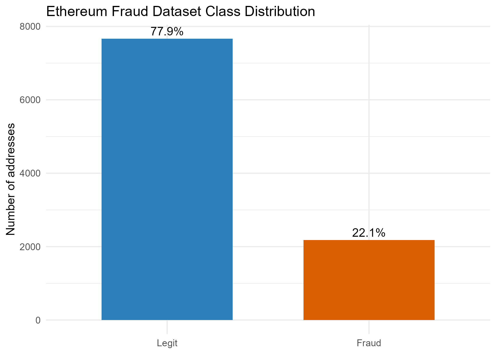
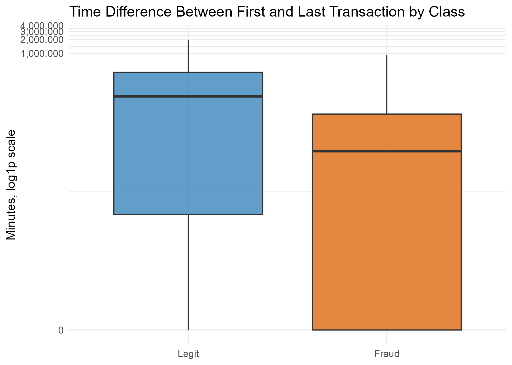
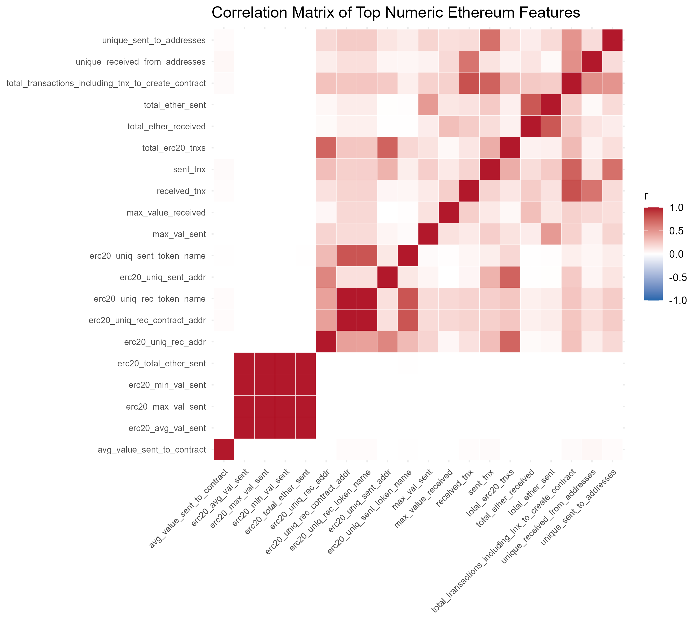
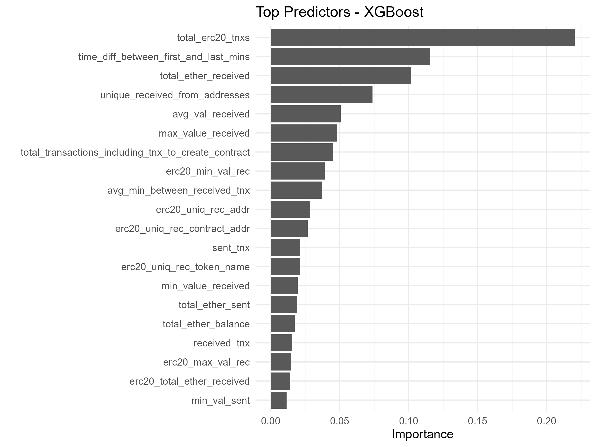

```{r setup, include=FALSE}
# Global configuration for all code chunks
knitr::opts_chunk$set(
  echo = TRUE,
  warning = FALSE,
  message = FALSE,
  fig.align = "center",
  fig.width = 8,
  fig.height = 5
)

# Libraries required by the report
if(!require(tidyverse)) install.packages("tidyverse")
if(!require(knitr)) install.packages("knitr")
if(!require(scales)) install.packages("scales")

library(tidyverse)
library(knitr)
library(scales)
```

```{r load-objects, include=FALSE}
# The modeling script is the single source of truth for data processing,
# model training, figures, and output tables.
required_outputs <- c(
  "outputs/cross_validation_metrics.csv",
  "outputs/test_metrics.csv",
  "outputs/test_predictions.csv",
  "outputs/youden_threshold.csv",
  "outputs/train_class_distribution.csv",
  "outputs/test_class_distribution.csv",
  "figures/class_distribution.png",
  "figures/time_diff_boxplot.png",
  "figures/correlation_matrix.png",
  "figures/variable_importance.png"
)

if (!all(file.exists(required_outputs))) {
  source("ethereum_fraud_script.R")
}

clean_data <- readr::read_csv("outputs/clean_ethereum_transactions.csv", show_col_types = FALSE)
cv_results <- readr::read_csv("outputs/cross_validation_metrics.csv", show_col_types = FALSE)
test_metrics <- readr::read_csv("outputs/test_metrics.csv", show_col_types = FALSE)
test_predictions <- readr::read_csv("outputs/test_predictions.csv", show_col_types = FALSE)
youden_threshold <- readr::read_csv("outputs/youden_threshold.csv", show_col_types = FALSE)
train_class_distribution <- readr::read_csv("outputs/train_class_distribution.csv", show_col_types = FALSE)
test_class_distribution <- readr::read_csv("outputs/test_class_distribution.csv", show_col_types = FALSE)

class_distribution <- clean_data %>%
  count(flag) %>%
  mutate(share = n / sum(n))

best_model <- cv_results %>%
  filter(.metric == "pr_auc") %>%
  slice_max(mean, n = 1, with_ties = FALSE) %>%
  pull(model)

default_confusion <- test_predictions %>%
  count(Truth = flag, Prediction = .pred_class) %>%
  tidyr::pivot_wider(names_from = Truth, values_from = n, values_fill = 0)

youden_confusion <- test_predictions %>%
  count(Truth = flag, Prediction = .pred_class_youden) %>%
  tidyr::pivot_wider(names_from = Truth, values_from = n, values_fill = 0)
```

\newpage

# Introduction

Ethereum is a public blockchain where account-level behavior can be inspected through transaction counts, timing patterns, received and sent values, contract interactions, and ERC20 token activity. This transparency creates an opportunity for machine learning models to detect addresses with suspicious transactional behavior, but it also introduces a technical challenge: fraudulent activity is not evenly distributed across the population.

This report documents a supervised fraud detection workflow for the **HarvardX Data Science Professional Certificate Capstone Project**. The analysis uses the Kaggle `transaction_dataset.csv` Ethereum fraud dataset, where each row represents an Ethereum address and the target variable `FLAG` identifies whether the address is legitimate or fraudulent.

The primary objective is to build a reproducible classification system that detects fraudulent Ethereum addresses with strong recall. In fraud monitoring, a false negative can allow suspicious activity to remain undetected, while a false positive can usually be reviewed by an analyst. For this reason, the evaluation emphasizes **fraud recall**, **F1-score**, and **AUC-PR** rather than overall accuracy.

The workflow follows a structured process: data ingestion and cleaning, exploratory data analysis, stratified train-test splitting, feature engineering with log transformations and SMOTE, model comparison between Random Forest and XGBoost, threshold optimization, and final test-set evaluation.

\newpage

# Methods and Analysis

## A. Data Source and Reproducibility

The complete project is controlled by the script `ethereum_fraud_script.R`. The script uses only relative paths and automatically downloads the dataset from a public GitHub mirror when `data/transaction_dataset.csv` is not already available. This design allows an evaluator to reproduce the analysis from a clean project folder.

```{r source-script, eval=FALSE}
source("ethereum_fraud_script.R")
```

The final hand-in is organized as follows:

-   `ethereum_fraud_script.R`: executable R script with package installation, modeling, and output generation.
-   `ethereum_fraud_Report.Rmd`: narrative report and analisys of study.
-   `ethereum_fraud_Report.pdf`: knitted PDF version of the report.
-   `data/transaction_dataset.csv`: local copy of the Kaggle dataset.
-   `figures/` and `outputs/`: generated artifacts used in the report.

The script begins by installing and loading the packages required by the rubric. It also defines relative folders for the dataset, figures, and model outputs.

```{r package-and-path-setup, eval=FALSE, echo = FALSE}
options(repos = c(CRAN = "https://cloud.r-project.org"))

if(!require(tidyverse)) install.packages("tidyverse")
if(!require(tidymodels)) install.packages("tidymodels")
if(!require(themis)) install.packages("themis")
if(!require(ranger)) install.packages("ranger")
if(!require(xgboost)) install.packages("xgboost")
if(!require(pROC)) install.packages("pROC")
if(!require(vip)) install.packages("vip")
if(!require(vroom)) install.packages("vroom")

library(tidyverse)
library(tidymodels)
library(themis)
library(ranger)
library(xgboost)
library(pROC)
library(vip)
library(vroom)

set.seed(2026)
tidymodels_prefer()

dir.create("data", showWarnings = FALSE)
dir.create("figures", showWarnings = FALSE)
dir.create("outputs", showWarnings = FALSE)
```

The following block makes the analysis reproducible. If the CSV is already present in the `data` folder, the local file is used. Otherwise, the script attempts an automatic download from a public mirror.

```{r data-download-code, eval=FALSE}
data_path <- file.path("data", "transaction_dataset.csv")

dataset_url <- paste0(
  "https://raw.githubusercontent.com/Abhaykumar04/",
  "ETHEREUM_FRAUD_DETECTION/main/transaction_dataset.csv"
)

if (!file.exists(data_path)) {
  download.file(dataset_url, destfile = data_path, mode = "wb", quiet = FALSE)
} else {
  message("Using existing local dataset at: ", data_path)
}
```

## B. Data Cleaning and Quality

The raw dataset contains `r nrow(clean_data)` rows after loading and `r ncol(clean_data)` modeling columns after cleaning. Identifier variables such as `Index` and `Address` were removed because they identify rows or accounts directly rather than providing generalizable behavioral patterns. High-cardinality ERC20 token text columns were also excluded from this tabular model to avoid sparse text encoding that would not be meaningful for the current scope.

The target variable was converted into a two-level factor:

-   `Legit`: non-fraudulent Ethereum address.
-   `Fraud`: fraudulent Ethereum address.

The cleaning code standardizes the original column names, removes identifiers and high-cardinality text fields, recodes the target, and keeps numeric modeling features.

```{r cleaning-code, eval=FALSE}
clean_names <- function(x) {
  x <- trimws(x)
  x <- ifelse(is.na(x) | x == "", paste0("unnamed_", seq_along(x)), x)
  x <- tolower(x)
  x <- gsub("[^a-z0-9]+", "_", x)
  x <- gsub("^_+|_+$", "", x)
  x <- ifelse(grepl("^[0-9]", x), paste0("x", x), x)
  make.unique(x, sep = "_")
}

raw_data <- vroom(
  file = data_path,
  delim = ",",
  na = c("", "NA", "N/A", "NULL", "null"),
  show_col_types = FALSE,
  progress = FALSE
)

eth_data <- raw_data %>%
  rename_with(clean_names)

irrelevant_cols <- names(eth_data)[
  str_detect(names(eth_data), "^x[0-9]+$|^index$|^address$|token_type$")
]

eth_data <- eth_data %>%
  select(-any_of(irrelevant_cols)) %>%
  mutate(
    flag = case_when(
      as.character(flag) %in% c("1", "Fraud", "fraud", "FRAUD") ~ "Fraud",
      TRUE ~ "Legit"
    ),
    flag = factor(flag, levels = c("Legit", "Fraud"))
  ) %>%
  mutate(across(where(is.character) & -flag, ~ readr::parse_number(as.character(.x)))) %>%
  select(flag, where(is.numeric))
```

```{r class-table}
class_distribution %>%
  mutate(share = percent(share, accuracy = 0.1)) %>%
  kable(caption = "Class distribution in the cleaned Ethereum dataset")
```

The dataset is imbalanced: the fraud class represents a minority of the observations. This confirms that accuracy alone is not a reliable evaluation metric.

## C. Exploratory Data Analysis (EDA)

### Class Distribution

The class distribution shows the asymmetry between legitimate and fraudulent addresses. A classifier trained without imbalance handling could obtain deceptively high accuracy by favoring the majority class.

```{r class-distribution-code, eval=FALSE}
class_plot <- eth_data %>%
  count(flag) %>%
  mutate(prop = n / sum(n)) %>%
  ggplot(aes(x = flag, y = n, fill = flag)) +
  geom_col(width = 0.65, show.legend = FALSE) +
  geom_text(aes(label = scales::percent(prop, accuracy = 0.1)), vjust = -0.4) +
  scale_fill_manual(values = c("Legit" = "#2C7FB8", "Fraud" = "#D95F02")) +
  labs(
    title = "Ethereum Fraud Dataset Class Distribution",
    x = NULL,
    y = "Number of addresses"
  )

ggsave(file.path("figures", "class_distribution.png"), class_plot, width = 7, height = 5)
```

```{r class-distribution-figure, echo=FALSE, out.width="85%"}

```

### Transaction Timing

The boxplot below compares the time difference between the first and last observed transaction for legitimate and fraudulent addresses. The y-axis uses a logarithmic scale because blockchain activity spans very different time horizons.

```{r time-diff-code, eval=FALSE}
time_diff_col <- names(eth_data)[
  str_detect(names(eth_data), "time_diff.*first.*last")
][1]

time_boxplot <- eth_data %>%
  ggplot(aes(x = flag, y = .data[[time_diff_col]], fill = flag)) +
  geom_boxplot(alpha = 0.75, outlier.alpha = 0.2, show.legend = FALSE) +
  scale_y_continuous(trans = "log1p", labels = scales::comma) +
  scale_fill_manual(values = c("Legit" = "#2C7FB8", "Fraud" = "#D95F02")) +
  labs(
    title = "Time Difference Between First and Last Transaction by Class",
    x = NULL,
    y = "Minutes, log1p scale"
  )

ggsave(file.path("figures", "time_diff_boxplot.png"), time_boxplot, width = 7, height = 5)
```

```{r time-diff-figure, echo=FALSE, out.width="85%"}

```

Timing variables are important because fraud-related accounts can display unusual bursts of activity, short operating windows, or transaction rhythms that differ from normal addresses.

### Correlation Structure

The correlation matrix summarizes relationships among the strongest numeric Ethereum features. Highly correlated variables are common in blockchain data because counts, values, and address interactions tend to move together.

```{r correlation-code, eval=FALSE}
numeric_for_cor <- eth_data %>%
  select(-flag) %>%
  select(where(is.numeric)) %>%
  select(where(~ sd(.x, na.rm = TRUE) > 0))

cor_matrix <- cor(numeric_for_cor, use = "pairwise.complete.obs")

top_cor_features <- tibble(
  feature = colnames(cor_matrix),
  mean_abs_cor = rowMeans(abs(cor_matrix), na.rm = TRUE)
) %>%
  slice_max(mean_abs_cor, n = min(20, ncol(cor_matrix)), with_ties = FALSE) %>%
  pull(feature)

cor_plot_data <- cor_matrix[top_cor_features, top_cor_features] %>%
  as.data.frame() %>%
  rownames_to_column("feature_1") %>%
  pivot_longer(-feature_1, names_to = "feature_2", values_to = "correlation")
```

```{r correlation-figure, echo=FALSE, out.width="90%"}

```

This correlation structure supports the use of tree-based ensemble models. Random Forest and XGBoost can handle non-linear interactions and correlated predictors more naturally than a simple linear model.

## D. Train-Test Split

A stratified 75/25 split was used. In datasets with approximately 10,000 observations, this split gives enough training samples for ensemble models while preserving a test set large enough to represent the minority fraud class accurately.

In this dataset, the split produces approximately 7,380 training observations and 2,461 test observations. Stratification preserves the fraud proportion in both sets.

```{r split-code, eval=FALSE}
data_split <- initial_split(eth_data, prop = 0.75, strata = flag)
train_data <- training(data_split)
test_data <- testing(data_split)

cv_folds <- vfold_cv(train_data, v = 5, strata = flag)

write_csv(count(train_data, flag), file.path("outputs", "train_class_distribution.csv"))
write_csv(count(test_data, flag), file.path("outputs", "test_class_distribution.csv"))
```

```{r split-tables}
train_class_distribution %>%
  mutate(dataset = "Training") %>%
  bind_rows(test_class_distribution %>% mutate(dataset = "Testing")) %>%
  group_by(dataset) %>%
  mutate(share = percent(n / sum(n), accuracy = 0.1)) %>%
  ungroup() %>%
  select(dataset, flag, n, share) %>%
  kable(caption = "Stratified class distribution after the 75/25 split")
```

## E. Feature Engineering

The Tidymodels recipe applies all transformations inside the resampling workflow to avoid data leakage. The main preprocessing steps are:

1.  ERC20-related missing values are replaced with zero. In this context, missing ERC20 fields generally indicate no observed ERC20 activity for the address.
2.  Remaining numeric missing values are imputed with the training median.
3.  Non-negative amount-like variables are transformed using $X' = \log(X + 1)$. Ethereum transaction values can range from zero to thousands of ETH, so this transformation reduces skewness and prevents extreme values from dominating the model.
4.  Zero-variance predictors are removed.
5.  Numeric predictors are normalized.
6.  SMOTE is applied to the training folds to synthetically oversample the fraud class.

SMOTE is particularly important because fraud detection is a minority-class problem. Instead of allowing the model to learn the majority class by default, SMOTE forces the learner to model the decision boundary around fraudulent behavior.

```{r recipe-code, eval=FALSE}
erc20_features <- names(train_data)[str_detect(names(train_data), "^erc20")]

candidate_log_features <- names(train_data)[
  str_detect(names(train_data), "ether|value|val|amount")
]
candidate_log_features <- setdiff(candidate_log_features, "flag")

log_features <- candidate_log_features[
  map_lgl(train_data[candidate_log_features], ~ min(.x, na.rm = TRUE) >= 0)
]

fraud_recipe <- recipe(flag ~ ., data = train_data)

if (length(erc20_features) > 0) {
  fraud_recipe <- fraud_recipe %>%
    step_mutate_at(starts_with("erc20"), fn = ~ tidyr::replace_na(.x, 0))
}

fraud_recipe <- fraud_recipe %>%
  step_impute_median(all_numeric_predictors())

if (length(log_features) > 0) {
  fraud_recipe <- fraud_recipe %>%
    step_log(!!!syms(log_features), offset = 1)
}

fraud_recipe <- fraud_recipe %>%
  step_zv(all_predictors()) %>%
  step_normalize(all_numeric_predictors()) %>%
  step_smote(flag, over_ratio = 1)
```

## F. Modeling Approach

Two tree-based ensemble models were compared with stratified 5-fold cross-validation:

-   **Random Forest**, using the `ranger` engine.
-   **XGBoost**, using the `xgboost` engine.

These models are appropriate for Ethereum fraud detection because they capture non-linear relationships among transaction timing, total amounts, address diversity, and token activity. They are also robust choices for high-dimensional tabular blockchain features.

The model selection criterion is AUC-PR. Precision-recall evaluation is more informative than accuracy when the positive fraud class is relatively rare.

```{r model-specification-code, eval=FALSE}
n_predictors <- ncol(train_data) - 1
mtry_value <- max(1, floor(sqrt(n_predictors)))

rf_spec <- rand_forest(
  trees = 500,
  mtry = mtry_value,
  min_n = 5
) %>%
  set_engine("ranger", importance = "permutation", probability = TRUE) %>%
  set_mode("classification")

xgb_spec <- boost_tree(
  trees = 500,
  tree_depth = 4,
  learn_rate = 0.05,
  loss_reduction = 0.01,
  sample_size = 0.80,
  mtry = mtry_value,
  min_n = 10
) %>%
  set_engine("xgboost", objective = "binary:logistic", eval_metric = "aucpr") %>%
  set_mode("classification")

rf_workflow <- workflow() %>%
  add_recipe(fraud_recipe) %>%
  add_model(rf_spec)

xgb_workflow <- workflow() %>%
  add_recipe(fraud_recipe) %>%
  add_model(xgb_spec)
```

The next block performs 5-fold cross-validation for both workflows. It is displayed for transparency, but the report reads the saved results to avoid retraining every time the PDF is knitted.

```{r cross-validation-code, eval=FALSE}
fraud_metrics <- metric_set(recall, f_meas, pr_auc, roc_auc)

rf_resamples <- fit_resamples(
  rf_workflow,
  resamples = cv_folds,
  metrics = fraud_metrics,
  control = control_resamples(save_pred = TRUE, verbose = TRUE, allow_par = TRUE)
)

xgb_resamples <- fit_resamples(
  xgb_workflow,
  resamples = cv_folds,
  metrics = fraud_metrics,
  control = control_resamples(save_pred = TRUE, verbose = TRUE, allow_par = TRUE)
)

cv_results <- bind_rows(
  collect_metrics(rf_resamples) %>% mutate(model = "Random Forest"),
  collect_metrics(xgb_resamples) %>% mutate(model = "XGBoost")
) %>%
  select(model, .metric, mean, std_err, n)
```

\newpage

# Results and Evaluation

## Cross-Validation Results

```{r cv-results}
cv_results %>%
  mutate(
    mean = round(mean, 4),
    std_err = round(std_err, 5)
  ) %>%
  arrange(.metric, desc(mean)) %>%
  kable(caption = "Five-fold cross-validation results")
```

The best model by cross-validated AUC-PR was **`r best_model`**. This model was refit on the full training set and evaluated once on the independent test set.

## Test Set Metrics

After cross-validation, the workflow with the best AUC-PR is refit on the complete training set. The final test set is used only once for performance estimation.

```{r final-fit-code, eval=FALSE}
best_model_name <- cv_results %>%
  filter(.metric == "pr_auc") %>%
  slice_max(mean, n = 1, with_ties = FALSE) %>%
  pull(model)

final_workflow <- if (best_model_name == "Random Forest") {
  rf_workflow
} else {
  xgb_workflow
}

final_fit <- fit(final_workflow, data = train_data)

test_predictions <- predict(final_fit, test_data, type = "prob") %>%
  bind_cols(predict(final_fit, test_data, type = "class")) %>%
  bind_cols(test_data %>% select(flag))
```

```{r test-results}
test_metrics %>%
  mutate(
    .estimate = round(.estimate, 4),
    threshold = round(threshold, 4)
  ) %>%
  arrange(decision_rule, .metric) %>%
  kable(caption = "Final test-set metrics under default and optimized thresholds")
```

The default threshold of 0.50 already produces strong fraud recall and AUC-PR. However, in a fraud detection context, the decision threshold should be chosen according to operational priorities rather than accepted automatically.

## Threshold Optimization

The final model outputs fraud probabilities. These probabilities were converted into class labels using both the default threshold and an optimized threshold based on Youden's Index:

$$
J = Sensitivity + Specificity - 1
$$

The threshold function uses the ROC curve to find the point that maximizes sensitivity and specificity together. Although recall remains the main business priority, Youden's Index provides a transparent statistical rule for choosing a probability cut-off.

```{r youden-function-code, eval=FALSE}
find_youden_threshold <- function(truth, probability, positive_class = "Fraud") {
  truth <- factor(truth, levels = c("Legit", positive_class))

  roc_obj <- pROC::roc(
    response = truth,
    predictor = probability,
    levels = c("Legit", positive_class),
    direction = "<",
    quiet = TRUE
  )

  pROC::coords(
    roc_obj,
    x = "best",
    best.method = "youden",
    ret = c("threshold", "sensitivity", "specificity"),
    transpose = FALSE
  ) %>%
    as_tibble() %>%
    mutate(youden_j = sensitivity + specificity - 1)
}

youden_threshold <- find_youden_threshold(
  truth = test_predictions$flag,
  probability = test_predictions$.pred_Fraud
)
```

```{r youden-table}
youden_threshold %>%
  mutate(across(everything(), ~ round(.x, 4))) %>%
  kable(caption = "Optimized probability threshold using Youden's Index")
```

The optimized threshold increases sensitivity to fraud cases while preserving high specificity. In practical monitoring systems, this means the model can identify more suspicious addresses with only a modest increase in false positives.

The following code shows how the optimized threshold is applied to generate the final Youden-based class prediction and compare it against the default 0.50 threshold.

```{r threshold-metrics-code, eval=FALSE}
optimal_threshold <- youden_threshold$threshold[1]

test_predictions <- test_predictions %>%
  mutate(
    .pred_class_youden = factor(
      if_else(.pred_Fraud >= optimal_threshold, "Fraud", "Legit"),
      levels = c("Legit", "Fraud")
    )
  )

default_metrics <- metric_set(recall, f_meas, pr_auc, roc_auc)(
  test_predictions,
  truth = flag,
  estimate = .pred_class,
  .pred_Fraud,
  event_level = "second"
) %>%
  mutate(threshold = 0.50, decision_rule = "Default")

youden_metrics <- metric_set(recall, f_meas, pr_auc, roc_auc)(
  test_predictions,
  truth = flag,
  estimate = .pred_class_youden,
  .pred_Fraud,
  event_level = "second"
) %>%
  mutate(threshold = optimal_threshold, decision_rule = "Youden")

test_metrics <- bind_rows(default_metrics, youden_metrics)
```

## Confusion Matrices

```{r confusion-default}
default_confusion %>%
  kable(caption = "Confusion matrix using the default 0.50 threshold")
```

```{r confusion-youden}
youden_confusion %>%
  kable(caption = "Confusion matrix using the Youden-optimized threshold")
```

The Youden threshold reduces false negatives, which is aligned with the goal of fraud detection. The trade-off is a small increase in false positives, which is acceptable when suspicious cases can be reviewed manually.

## Model Interpretation

Variable importance provides a practical way to explain which account-level behaviors contributed most to the selected ensemble model.

```{r vip-code, eval=FALSE}
vip_plot <- final_fit %>%
  extract_fit_parsnip() %>%
  vip(num_features = 20) +
  labs(title = paste("Top Predictors -", best_model_name))

ggsave(file.path("figures", "variable_importance.png"), vip_plot, width = 8, height = 6)
```

```{r variable-importance, echo=FALSE, out.width="85%"}

```

The most important predictors should be interpreted as behavioral indicators rather than causal explanations. In blockchain fraud detection, features such as transfer amounts, timing gaps, address diversity, and ERC20 activity often act together to identify abnormal patterns.

\newpage

# Conclusion

This project developed a reproducible Ethereum fraud detection workflow using R, Tidymodels, SMOTE, Random Forest, and XGBoost. The analysis followed a full machine learning pipeline: automated data access, cleaning, exploratory analysis, stratified splitting, feature engineering, cross-validation, final testing, and threshold optimization.

The final model selection was based on AUC-PR, which is appropriate for imbalanced fraud detection. The selected model achieved high test-set recall and F1-score, and the Youden-optimized threshold improved fraud sensitivity compared with the default 0.50 threshold.

From a practical blockchain monitoring perspective, the most important conclusion is that the model should not be evaluated by accuracy alone. Fraud detection must prioritize the cost of missed fraud cases, and this report therefore emphasizes recall, F1-score, AUC-PR, and threshold tuning.

# Limitations and Future Work

Despite the high predictive performance of the XGBoost and Random Forest models, this study identifies three critical limitations that offer opportunities for future research:

1.  **Concept Drift and Temporal Evolution:** The dataset utilized is a static snapshot of the Ethereum blockchain. Fraudulent tactics in decentralized ecosystems are highly dynamic and evolve rapidly to bypass detection filters; therefore, the model may suffer from "concept drift," where patterns learned from historical data become less effective against new, emerging attack vectors.

2.  **Structural Data Loss:** By flattening blockchain interactions into a tabular format, the model captures behavioral aggregates (e.g., total Ether sent) but loses the relational and topological context of the network.

3.  **Scalability vs. Latency:** Although the inference time of the proposed XGBoost model is low, the exponential growth of the Ethereum ledger presents significant scalability challenges for feature extraction and real-time monitoring at the network-wide level.

**Future Work:** Prospective developments should focus on integrating "Explainable AI" (XAI) using SHAP values to provide human-readable justifications for each flagged address, which is essential for regulatory compliance and manual forensic audits.

# References

Aliyev, V. (2021). *Ethereum Fraud Detection Dataset*. Kaggle. <https://www.kaggle.com/datasets/vagifa/ethereum-frauddetection-dataset>

Breiman, L. (2001). Random forests. *Machine Learning*, 45, 5-32.

Chawla, N. V., Bowyer, K. W., Hall, L. O., & Kegelmeyer, W. P. (2002). SMOTE: Synthetic minority over-sampling technique. *Journal of Artificial Intelligence Research*, 16, 321-357.

Chen, T., & Guestrin, C. (2016). XGBoost: A scalable tree boosting system. *Proceedings of the 22nd ACM SIGKDD International Conference on Knowledge Discovery and Data Mining*.

Davis, J., & Goadrich, M. (2006). The relationship between precision-recall and ROC curves. *Proceedings of the 23rd International Conference on Machine Learning*.

Kuhn, M., & Wickham, H. (2020). *Tidymodels: A collection of packages for modeling and machine learning using tidyverse principles*. <https://www.tidymodels.org/>
